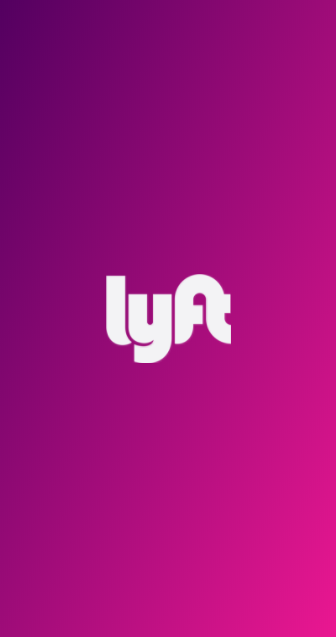
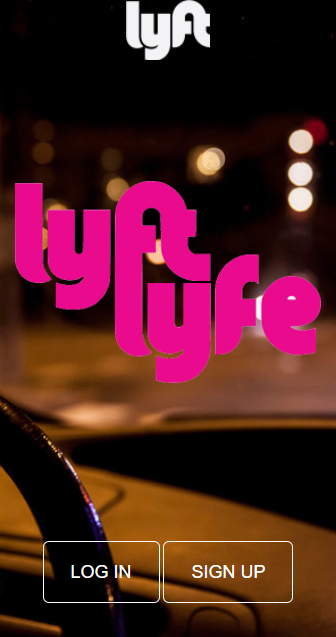
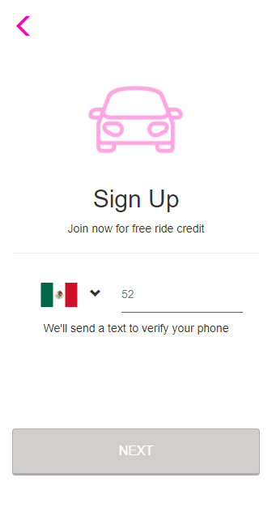
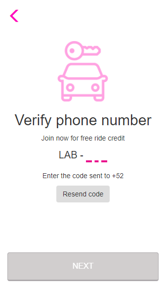
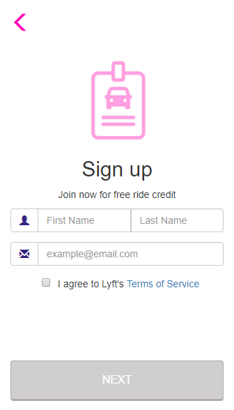
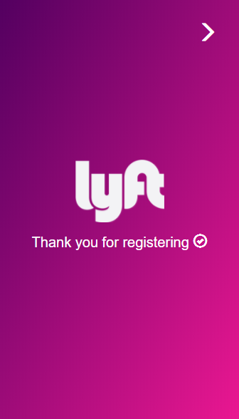

# Reto LYFT - MOBILE
---
## Objetivo

Desarrolla una web-app que replique el sitio de Lyft, en este reto deberás cumplir los pasos necesarios para que tu usuario pueda registrarse.

## Especificaciones Obligatorias

* Vista splash con duración de 2 a 5 segundos que redirecciona a tu vista de inicio. La vista de inicio cuenta con dos botones, en esta ocasión seguiremos el flujo de SIGN UP. 
* En la siguiente vista tenemos un formulario donde nuestro usuario puede escoger el país y debe ingresar su número de teléfono. El botón de NEXT debe estar deshabilitado hasta que se ingrese un número de 10 dígitos. 
* Una vez ingresado el número de teléfono se habilita el botón y al dar click debe enviar una alerta con un código generado aleatoriamente (LAB-000) y redireccionar a la siguiente vista. 
* En esta vista se debe ingresar el código dado anteriormente y una vez hecho esto se habilita el botón que redirecciona a nuestro usuario a la vista donde ingresa sus datos. (Puede tener la opción de enviar otro código.) 
* Para ingresar sus datos necesitamos un formulario que le pida su nombre, apellido y correo electrónico. Deberá también tener un checkbox para que se acepten los términos y condiciones del servicio. 
* Ya que se ha realizado lo anterior, sólo se deberá mostrar una vista al usuario que le indique que ha concluido con el registro exitosamente. 
* Todas nuestras vistas deben de contar con una manera de regresar a la vista anterior.

## Especificaciones de Desarrollo

* La página principal es denominada `index.html` en el cual se encuentra al vista splash solicitada  y se enlaza las hojas de estilos propias y las de Bootstrap.

* En la carpeta `css` se encuentra el archivo `main.css` donde se han agragado los  estilos necesarios para el proyecto.

* En la carpeta `vendors` se encuentran los archivos de Bootstrap y jquery.

* En la carpeta `js` se encuentran los archivos jquery por cada vista desarrollada.

* En la carpeta `views` se encuentran las 5 vistas necesarias para el proyecto.

* En la carpeta `assets` se encuentra la carpeta `images` donde estan las imágenes necesarias para el proyecto.

* Esta web utiliza 1 tipografía :   `Sains`.

* La paleta de colores se basa en estos tres : `#FF00BF` y   `#fff`.

* Los íconos se obtuvieron de  Bootstrap.

* En el desarrollo del proyecto se han utilizado diferentes tipos de efectos sobre algunos títulos e imágenes, todo esto especificado en la hoja de estilos main.css.

### Versión Mobile

#### Vista Splash

#### Vista 1

#### Vista 2

#### Vista 3

#### Vista 4

#### Vista 5

Realizado por Carla Centeno Ramos.
